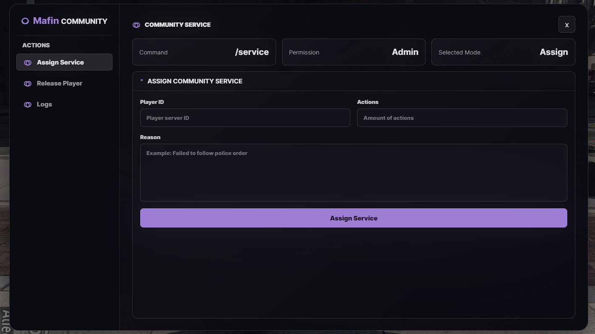
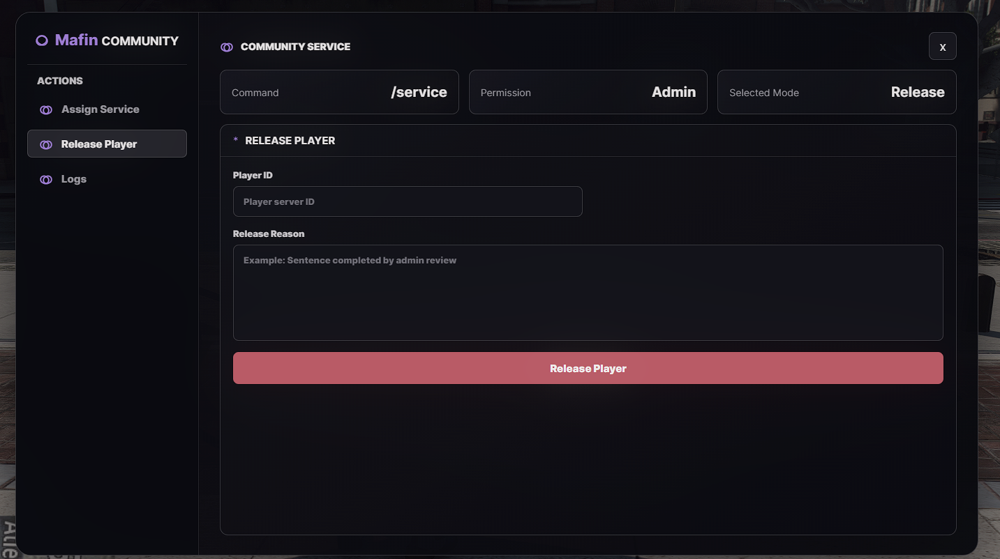
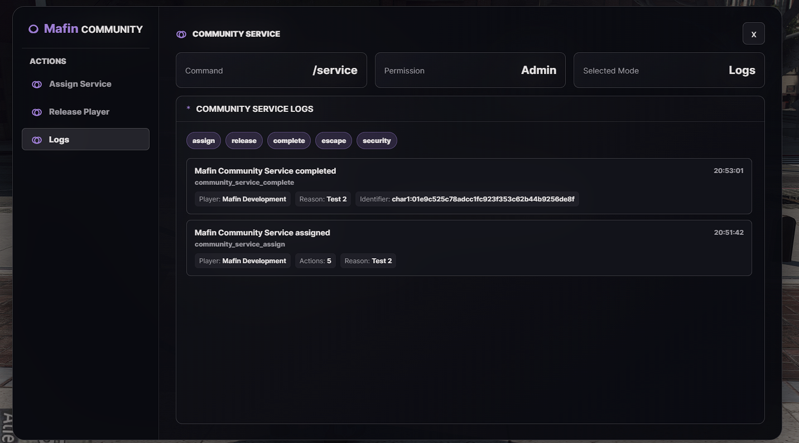

# Mafin Community Service

Server-authoritative ESX/QBCore community service resource for FiveM, with a dark admin menu, reason tracking, in-menu logs, anti-cheat validation, and outdoor cleanup points.

## Preview

### Assign Service


### Release Player


### Logs


## Features

- Admin menu command: `/service`
- Release command: `/servicerelease`
- Community service reason shown to the player
- In-menu logs for assign, release, complete, escape, and security events
- Server-side validation for actions, distance, timing, and repeated cleanup spots
- 40 outdoor cleanup points with per-cycle respawn
- Optional Discord webhook logging

## Setup

Add the resource to your server and ensure it after dependencies:

```cfg
ensure oxmysql
ensure ox_lib
ensure mafin_communityservice
```

Add admin permission:

```cfg
add_ace group.admin communityService allow
```

Import `communityservice.sql` if your database table does not already exist.

## Commands

```text
/service
/service [id] [actions] [reason]
/servicerelease
/servicerelease [id] [reason]
```

## Configuration

Main settings are in `config.lua`, including framework selection, admin groups, webhook logging, cleanup points, blips, and service limits.
